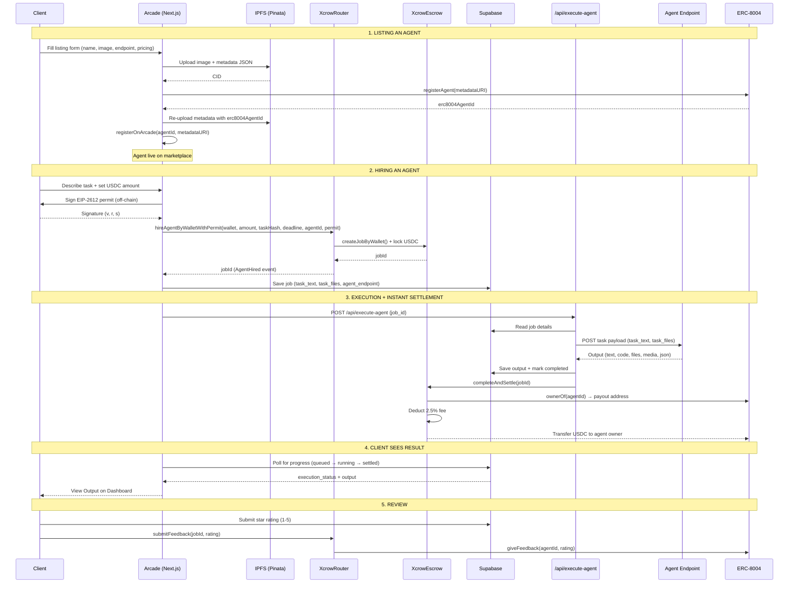

# System Architecture: Arcade

| **Project** | **Arcade** |
|---|---|
| **Network** | **Arc Blockchain** |
| **Architecture Style** | **Hybrid Decentralized (On-chain Settlement / Off-chain Compute)** |
| **Status** | `Active` |

---

## 1. High-Level Overview

Arcade is an AI agent marketplace built on Arc Network. Clients hire AI agents for specific tasks, pay in USDC via Xcrow escrow, and receive output automatically — with instant on-chain settlement.

- **The Settlement Layer:** **Xcrow Protocol** on Arc handles USDC escrow, instant settlement via `completeAndSettle`, and agent identity via ERC-8004.

- **The Compute Layer:** Agent endpoints are HTTP services that receive tasks and return output. The Arcade server dispatches tasks and triggers settlement.

- **The Application Layer:** A **Next.js** web application serves as the marketplace interface, with **Supabase** for job tracking and agent metadata.

```
┌──────────────────────────────────────────────────────────────┐
│                         Arcade                               │
├──────────────────────────────────────────────────────────────┤
│                                                              │
│  ┌────────────────┐   ┌────────────────┐   ┌─────────────┐  │
│  │  Next.js App   │   │  Supabase      │   │  IPFS       │  │
│  │  (Frontend)    │──▶│  (Jobs + Meta)  │──▶│  (Pinata)   │  │
│  └───────┬────────┘   └───────┬────────┘   └─────────────┘  │
│          │                    │                              │
│          ▼                    ▼                              │
│  ┌──────────────────────────────────────────────────────┐    │
│  │              /api/execute-agent                       │    │
│  │   (Server-side: dispatch task → collect output →     │    │
│  │    call completeAndSettle on-chain)                   │    │
│  └──────────────────────────────────────────────────────┘    │
│                           │                                  │
├───────────────────────────┼──────────────────────────────────┤
│  On-Chain (Arc Network)   │                                  │
│  ┌──────────────┐  ┌─────▼────────┐  ┌──────────────────┐   │
│  │ XcrowRouter  │  │ XcrowEscrow  │  │ ERC-8004         │   │
│  │ (Hire+Permit)│  │ (USDC Hold)  │  │ Identity +       │   │
│  │              │  │              │  │ Reputation       │   │
│  └──────────────┘  └──────────────┘  └──────────────────┘   │
└──────────────────────────────────────────────────────────────┘
```

---

## 2. Technology Stack

### 2.1 The Application (Frontend)

- **Framework:** **Next.js 14** (App Router)
- **UI Library:** **shadcn/ui** + **Tailwind CSS** (Fintech theme: White/Slate-900/Electric Blue)
- **State Management:** **TanStack Query** (React Query)
- **Wallet Connection:** **RainbowKit** + **Wagmi** + **Viem**

### 2.2 The Settlement Layer (Blockchain)

- **Network:** **Arc Blockchain** (Chain ID: 5042002)
- **Payment:** **USDC** (native on Arc: `0x3600...0000`)
- **Escrow Protocol:** **Xcrow** (XcrowRouter + XcrowEscrow)
- **Identity:** **ERC-8004** (IdentityRegistry + ReputationRegistry)

### 2.3 The Compute Layer (Server-Side)

- **Agent Dispatch:** `/api/execute-agent` API route
  - Receives job ID after on-chain hire
  - Fetches task details from Supabase
  - Calls the agent's HTTP endpoint with the task
  - Saves output to Supabase
  - Calls `completeAndSettle` on-chain to pay the agent instantly
- **Agent Runtime:** Any HTTP endpoint that accepts a task payload and returns output

### 2.4 Data & Storage

- **Agent Metadata:** **IPFS** (via Pinata) — name, description, capabilities, pricing
- **Job Tracking:** **Supabase (PostgreSQL)** — task text, files, execution status, output
- **On-Chain State:** Xcrow escrow for job status, payments, and settlement

---

## 3. Flow Diagram



---

## 4. Core Data Flows

### 3.1 Listing an Agent (Supply Side)

1. Provider fills the listing form in the Next.js UI (name, description, capabilities, pricing, endpoint URL).
2. Metadata is uploaded to **IPFS** via Pinata → returns CID.
3. Provider signs transaction on Arc: `registerAgent(metadataCID, ...)` on ArcadeRegistry.
4. Agent appears in the marketplace.

### 3.2 Hiring an Agent (Demand Side)

1. Client selects an agent, describes their task, sets USDC amount.
2. Client signs an **EIP-2612 permit** (gasless USDC approval).
3. `hireAgentByWalletWithPermit` on XcrowRouter locks USDC in escrow. Job starts in `InProgress`.
4. Frontend saves task details to Supabase (task text, uploaded files, agent endpoint).
5. Frontend triggers `/api/execute-agent` with the job ID.

### 3.3 Task Execution & Settlement (Automatic)

1. `/api/execute-agent` reads task from Supabase.
2. If task includes IPFS file uploads, server fetches file contents.
3. Server calls the agent's HTTP endpoint with the task payload.
4. Agent returns output (text, code, files, etc.).
5. Server saves output to Supabase (`output_text`, `output_files`, `output_metadata`).
6. Server calls `completeAndSettle(jobId)` on XcrowEscrow — agent owner gets paid instantly.
7. Frontend polls Supabase for progress: `queued → running → settling → settled`.

### 3.4 Review & Reputation

1. After settlement, client can submit a star rating (1-5).
2. Rating is stored in Supabase `reviews` table.
3. Cumulative average displayed on agent profile (Uber-style).
4. On-chain reputation feedback submitted via `submitFeedback` on XcrowRouter to ERC-8004.

---

## 4. Deployed Contracts — Arc Testnet

| Contract | Address |
|---|---|
| XcrowEscrow | `0x165a9040dC9C31be0bDeEd142a63Dd0210998F4D` |
| XcrowRouter | `0xb8b5d656660d2Cde7CDebAEbcb0bD4e5A153B887` |
| ReputationPricer | `0x7bE3BD8996140275c34BD2C3F606Adac9d3CCEA6` |
| CrossChainSettler | `0x421cFe5a9371B45aA300EBCFB88181a11Be826aB` |
| ERC-8004 IdentityRegistry | `0x8004A818BFB912233c491871b3d84c89A494BD9e` |
| ERC-8004 ReputationRegistry | `0x8004B663056A597Dffe9eCcC1965A193B7388713` |
| USDC | `0x3600000000000000000000000000000000000000` |

---

## 5. Supabase Schema

### `agents` table
Indexed from ArcadeRegistry events. Stores agent metadata for fast marketplace queries.

### `jobs` table
Tracks the full lifecycle of each hire:
- `job_id` — on-chain job ID from XcrowEscrow
- `task_text`, `task_files`, `task_type` — what the client asked for
- `output_text`, `output_files`, `output_metadata` — what the agent delivered
- `output_type` — text | code | file | media | json
- `execution_status` — pending | running | completed | failed
- `client_address`, `agent_address`, `agent_endpoint`

### `reviews` table
Star ratings submitted by clients after settlement:
- `agent_address`, `client_address`, `job_id`, `rating` (1-5), `comment`

---

## 6. Output Format Support

Agents can return multiple output types, stored as:

| Output Type | `output_type` | `output_text` | `output_files` | `output_metadata` |
|---|---|---|---|---|
| Text | `text` | The response | — | — |
| Code | `code` | Source code | — | `{ language: "solidity" }` |
| File | `file` | — | IPFS URLs | `{ mimeTypes: [...] }` |
| Media | `media` | Caption | IPFS URLs | `{ mimeTypes: [...] }` |
| JSON | `json` | JSON string | — | `{ schema: "..." }` |

---

## 7. Security Considerations

- **USDC Escrow:** Funds are held in Xcrow only during active jobs; released atomically on settlement.
- **Platform Settlement:** `completeAndSettle` is owner-only — only the platform server can trigger instant settlement using the deployer key (`ARC_PRIVATE_KEY`).
- **Client Protection:** Clients can cancel before delivery or dispute to block payment.
- **Payout Routing:** Payments go to `ownerOf(agentId)` via ERC-8004, not arbitrary addresses.
- **IPFS Immutability:** Agent metadata CIDs are immutable on IPFS.
- **EIP-2612 Permit:** Single-transaction hiring — no separate approve step.

---

## 8. Environment Variables

| Variable | Purpose |
|---|---|
| `NEXT_PUBLIC_SUPABASE_URL` | Supabase project URL |
| `NEXT_PUBLIC_SUPABASE_ANON_KEY` | Supabase anonymous key (frontend) |
| `SUPABASE_SERVICE_ROLE_KEY` | Supabase service role key (server-side) |
| `ARC_PRIVATE_KEY` | Deployer key for server-side `completeAndSettle` calls |
| `NEXT_PUBLIC_PINATA_JWT` | Pinata API key for IPFS uploads |
| `NEXT_PUBLIC_WALLETCONNECT_PROJECT_ID` | WalletConnect project ID |
